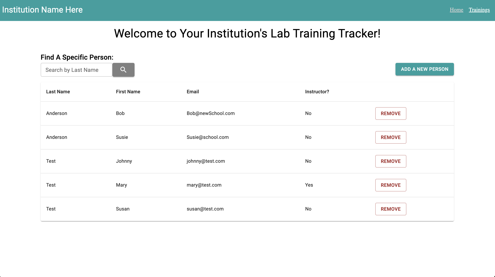
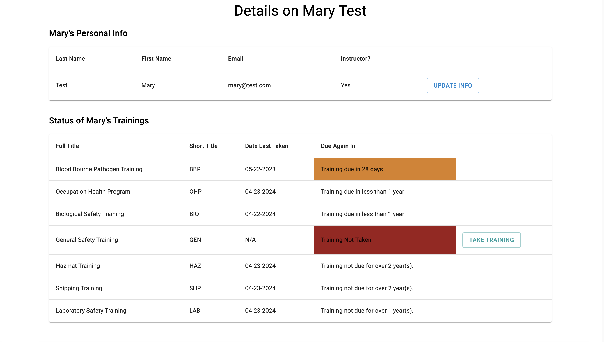
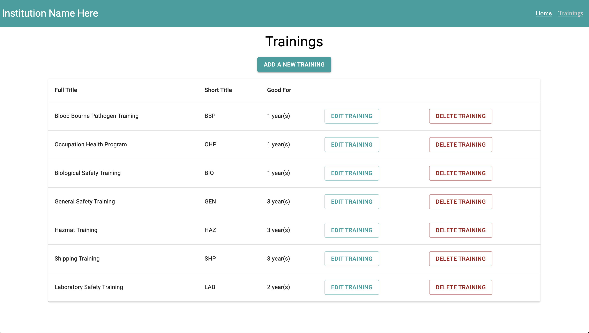

# Lab Training Tracker

## Description

_Druation: 5 Days_

This application is meant for assissting an overseer of a science department at an academic institution with tracking when students and faculty have completed their requisite trainings for lab work. The user is able to update or delete details for each student, faculty, or training as well.

## Screen Shots

 

## Getting Started

### Prerequisites

- [Node.js](https://nodejs.org/en/)
- [Postgres](https://www.postgresql.org/download/)
- [Postico](https://eggerapps.at/postico/v1.php)

### Installation

1. Create a database named `lab_training_tracker`.
2. Use the queries in the `database.sql` file to create all necessary tables. I recommend using Postico (linked above) to run those queries as that is what was used to create the queries.
3. Open up your editor of choice and run `npm install`.
4. Run `npm run server` in your terminal.
5. Run `npm run client` in your terminal.
6. Click the link given by `npm run client` to open a new tab with the running project! 

## Usage

1. The landing page displays the current list of faculty and students in the science department at the institution. Click the "Add a New Person" button to add a new person. Once added, a person can be deleted using the "Remove" button.
2. To find a specific person, you can enter their last name in the search bar in the top left corner and clicking the magnifying glass icon. The page will then display all people with a matching or partially matching last name. To return to the full list of people, either refresh the page or empty the search bar and click the magnifying glass icon once more.
3. To view the details and training statuses of a specific person, simply click on their row in the table. This will bring you to a page displaying further details about the person you clicked on. Their basic information can be updated by clicking the "Update Info" button at the top. The training statuses table further down the page displays when/if the person has taken the requisite lab trainings and when they are due for renewal. If a training needs to be taken again or for the first time, simply click the "Take Training" button next to the associated training. This will update when they have taken the test to the day the "Take Training" button was clicked.
4. To view the information of trainings in general, click the "Trainings" link on the navbar at the top of the page. This will bring you to a page displaying all the current trainings required in the system. You can Add, Edit, or Delete a training by clicking the associated button.

## Built With

* Javascript
* React
* Redux
* Postgres
* Express
* Axios
* Material UI
* SweetAlerts
* Moment.JS
* Fuse.JS

## Acknowledgements

Thank you to Dave Vinson for giving me the idea for this project and assisting in the scoping process!